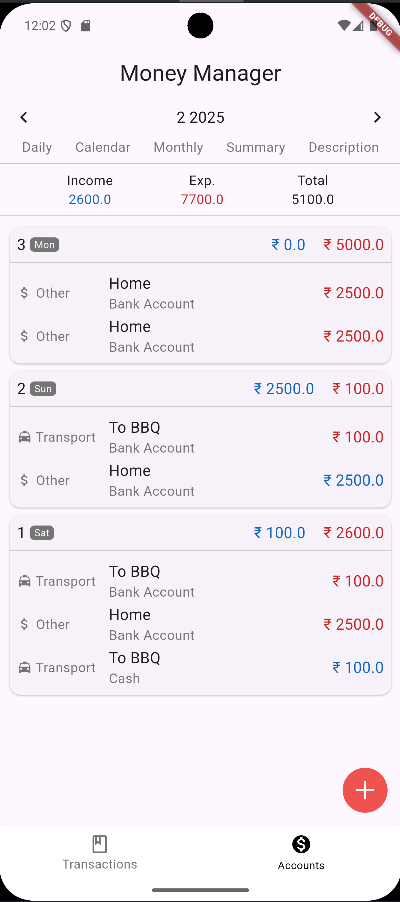
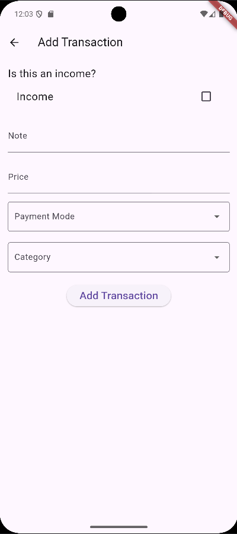
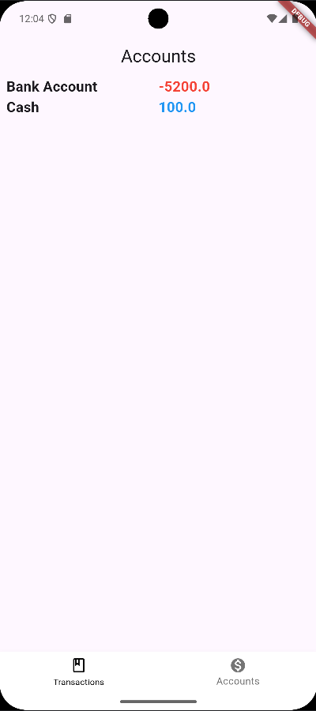

# Money Manager

Money Manager is a Flutter-based mobile application designed to help users track their income and expenses efficiently. The app provides an intuitive interface to manage daily transactions, categorize expenses, and visualize financial data.

## Features

- Add, edit, and delete income and expense transactions
- Categorize transactions for better tracking
- View monthly and yearly financial summaries
- Interactive charts for visualizing expenses and income
- Secure and easy-to-use interface

## Technologies Used

- **Flutter** - Frontend framework
- **Dart** - Programming language
- **Provider** - State management
- **Hive / SQLite** - Local database storage
- **Charts_flutter** - Data visualization

## Installation

1. Clone the repository:
   ```sh
   git clone https://github.com/krishmaniyar/money-manager.git
   ```
2. Navigate to the project directory:
   ```sh
   cd money-manager
   ```
3. Install dependencies:
   ```sh
   flutter pub get
   ```
4. Run the app:
   ```sh
   flutter run
   ```

## Screenshots





## Contributing

Contributions are welcome! If you would like to contribute:

1. Fork the repository.
2. Create a new branch:
   ```sh
   git checkout -b feature-branch
   ```
3. Commit your changes:
   ```sh
   git commit -m "Add new feature"
   ```
4. Push to the branch:
   ```sh
   git push origin feature-branch
   ```
5. Open a pull request.

## License

This project is licensed under the MIT License.

## Contact

For any queries or support, feel free to reach out:

- **Developer:** Krish Maniyar
- **GitHub:** [@krishmaniyar](https://github.com/krishmaniyar)
- **Live Demo:** [Coming Soon]